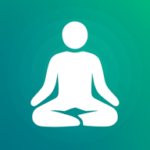
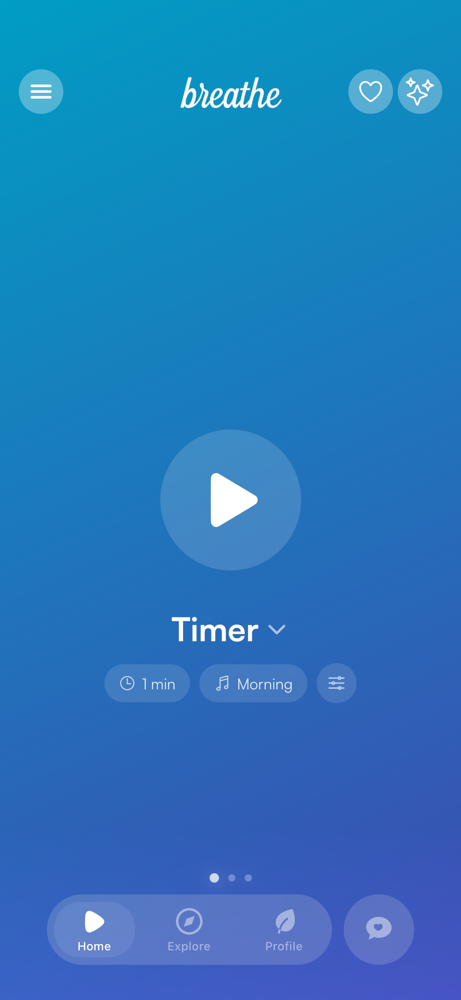
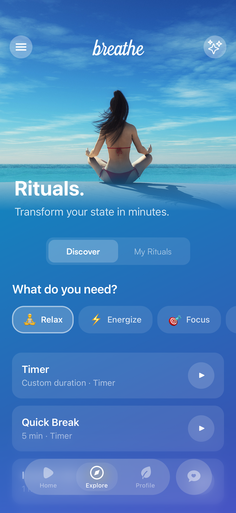
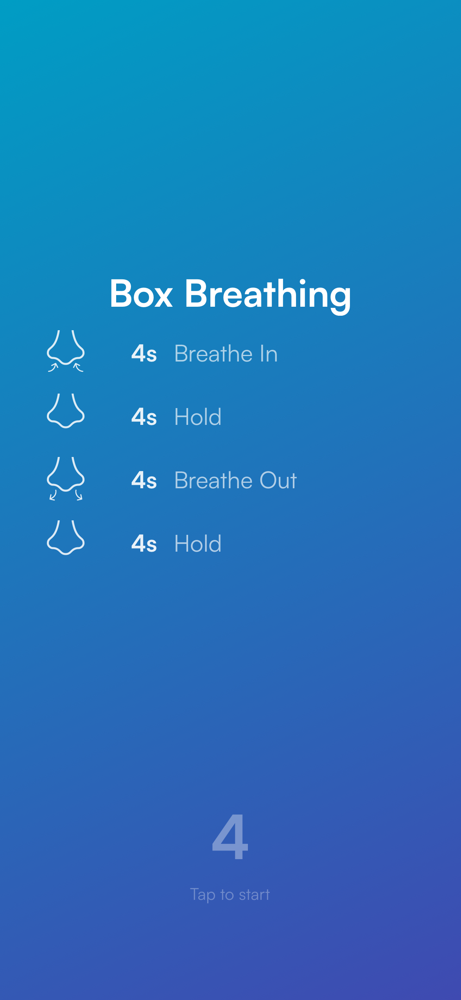
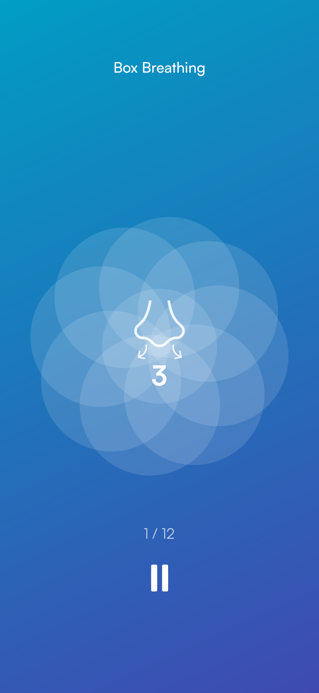
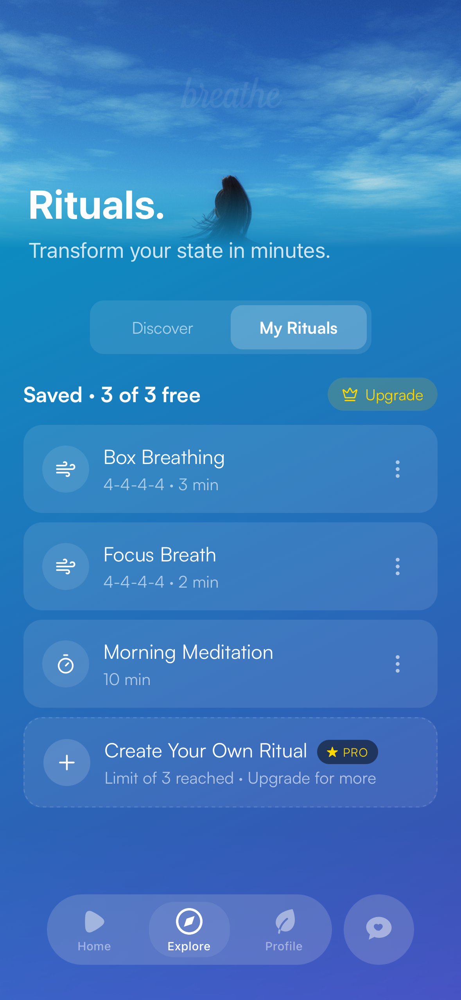
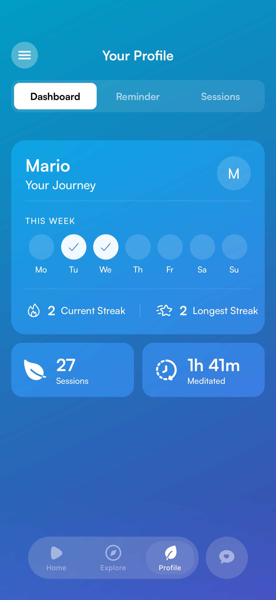

  

  # breathe

  ### Rituals for your mind. Timer, breathing & meditation.

  **Open the app. Breathe. Feel better.**

  
  &nbsp;&nbsp;
  

    

  [Features](#-features) • [Screenshots](#-screenshots) • [Contact](#-contact)

---

## Features

**Rituals** — Short, focused routines for every state of mind. Stressed? Tired? Can't focus? Pick what you need: Calm, Energy, Focus, or Sleep.

**Breathing Exercises** — Science-based techniques like Box Breathing, 4-7-8, Physiological Sigh, and more. Visual animations guide you through every phase.

**Meditation Timer** — Open timer with background sounds and interval bells. From 1 minute to as long as you want.

**Sounds & Music** — A library of background sounds and music to deepen your practice.

**Themes** — Multiple visual themes to match your mood. From ocean blue to desert sunset.

**Progress & Stats** — Calendar view, streaks, session history, and mood tracking. See your journey at a glance.

**Sync Across Devices** — Your meditations and statistics safely synced to the cloud.

**Favorites** — Save your favorite rituals and find them instantly.

**Reminders** — Daily reminders to keep you connected to your practice.

---

## Screenshots

  &nbsp;&nbsp;
  &nbsp;&nbsp;
  &nbsp;&nbsp;
  

 

  &nbsp;&nbsp;
  

---

## Contact

- **Email**: [contact@breathejourney.com](mailto:contact@breathejourney.com)
- **Website**: [breathejourney.com](https://breathejourney.com)

---

  Made with ♥ by breathe

